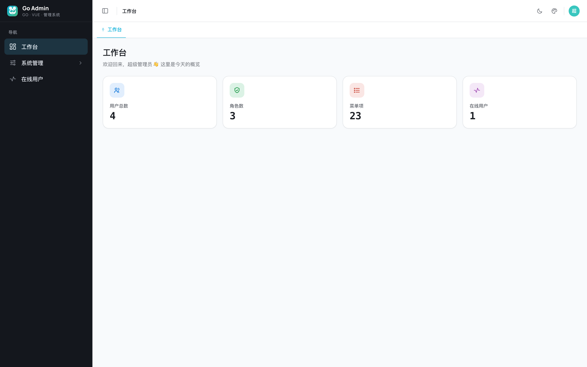

<div align="center">


# Go Admin

**A lightweight, modern full-stack admin framework built with Go + Vue**

`Go · Vue · Admin System`

[](https://github.com/swlfigo/go-admin/actions/workflows/ci.yml)
[](https://go.dev)
[](https://vuejs.org)
[](https://www.typescriptlang.org)
[](https://element-plus.org)
[](https://www.postgresql.org)
[](LICENSE)

[简体中文](README.md) · **English**

<br/>



</div>

---

## Overview

Go Admin is a **permission-management console**: a super admin configures permissions, a sub-admin manages users, and regular users see different UIs based on their roles. At its core it closes the **User → Role → Menu/Button permission** RBAC loop — **configured entirely by checkboxes in the UI, no JSON or code required**.

Why Go over Java: compiles to a single binary, no runtime dependency, runs in tens of MB of RAM, with a clean dependency tree — ideal for a long-running, lightweight admin service.

## ✨ Features

**🔐 Auth & Security**
- Dual tokens (access + refresh) with **refresh rotation** + server-side session validation
- Four layers of brute-force defense: image captcha · failed-attempt lockout · login rate-limit · bcrypt
- Zero Redis in phase 1 (sessions/lockout in DB, rate-limit in memory); authorization behind a swappable `Enforcer` interface (Casbin-ready)

**👥 RBAC**
- Users: CRUD · assign roles · reset password · unlock · enable/disable
- Roles: **menu/button permission tree** (built-in `super_admin` is undeletable)
- Menus: directory/menu/button tree managing dynamic routes + permission codes
- Dictionaries: type + data, editable at runtime
- **Operation-log audit**: middleware records every mutation (user/method/path/status/latency/IP) + a log viewer page
- **Server monitor**: live CPU / memory / disk / Go runtime (goroutines/version/uptime) dashboard
- API-level authorization middleware: hidden buttons on the frontend **and** independent backend checks

**📊 Experience**
- Dynamic menus (backend returns by role → frontend registers routes) + `v-permission` button-level control
- **Online users** + instant kick · personal center (profile / password)
- Tabs: open/close/**pin** + context menu + persistence
- Theming: light/dark · 7 accent colors (Go cyan by default) · density · sidebar/tab styles, live & persisted
- **i18n**: live Chinese / English switch (incl. Element Plus components & dynamic menu names), selectable in settings
- Initials avatar (no upload, hashed color)

## 🎨 Brand

Go Admin's brand colors come from the official colors of its two technologies, which pair naturally:

| | Color | Usage |
|---|---|---|
| **Go Cyan** | `#00ADD8` | Primary · links · highlights |
| **Vue Green** | `#42B883` | Success · data trends |
| **Brand Gradient** | `#00ADD8 → #42B883` | Logo · sidebar mark (fixed, accent-independent) |

The logo is **Gopher V** — a geometric take on Go's mascot: big eyes for recognition, two teeth echoing Vue's double-V, still legible at a 16px favicon.

## 🏗 Tech Stack

| Layer | Choice |
|---|---|
| **Backend** | Go 1.26 · gin · gorm · PostgreSQL 16 · golang-jwt · bcrypt · viper · base64Captcha |
| **Frontend** | Vue 3 + TypeScript (strict, no `any`) · Vite · Pinia · Vue Router · Element Plus · vitest |
| **Architecture** | Layered (handler / service / repository / model) · design-token theming · dynamic routing |

## 📁 Structure

```
go-admin/
├── server/              Go backend
│   ├── cmd/server/      entrypoint
│   ├── internal/        handler / service / repository / model / middleware / auth
│   ├── pkg/             jwt / password / captcha / response
│   └── configs/         config.yaml
├── web/                 Vue frontend
│   └── src/             api / stores / layout / views / components / router
└── docs/                documentation
```

## 🚀 Quick Start

**Prerequisites**: Go 1.26+ · Node 18+ · PostgreSQL 16 (Docker recommended, or any reachable PostgreSQL)

```bash
# 1) PostgreSQL
docker run -d --name go-admin-pg \
  -e POSTGRES_PASSWORD=postgres -e POSTGRES_DB=go_admin \
  -p 5432:5432 postgres:16

# 2) Backend (:8080) — auto-migrates and seeds on first run
cd server && make run

# 3) Frontend (:5173)
cd web && npm install && npm run dev
```

Open **http://localhost:5173**, default account **`admin` / `admin123`**.

## 🐳 One-command Docker deploy

Only Docker required — no local Go/Node:

```bash
docker compose up -d --build
```

Open **http://localhost:8088**, default account `admin` / `admin123`.

- Three services: `db` (PostgreSQL) + `server` (Go backend, auto-migrates & seeds on first run) + `web` (Caddy serving the SPA and proxying `/api`)
- **Images are built locally** — only public base images are pulled (postgres / golang / node / caddy), **no DockerHub account needed**
- Change `GOADMIN_JWT_SECRET` (and optionally `GOADMIN_ADMIN_PASSWORD`) in `docker-compose.yml` before production
- Stop: `docker compose down` (data kept in the `pgdata` volume)

> Config supports **env-var overrides** (`GOADMIN_<SECTION>_<KEY>`, e.g. `GOADMIN_DATABASE_HOST`, `GOADMIN_JWT_SECRET`) so you can inject secrets without editing `config.yaml`.

## ⚙️ Configuration

All config lives in `server/configs/config.yaml`:

| Block | Description |
|---|---|
| `database` | PostgreSQL connection |
| `jwt` | `secret` (⚠️ replace with a strong random string in production) · token TTLs |
| `admin` | **initial super-admin credentials** (written only on first DB init) |
| `captcha` | image-captcha toggle |
| `login` | lockout threshold · lock duration · login rate-limit |

> **Security**: replace `jwt.secret` and `admin.password` before going to production.

## 🧪 Tests

```bash
cd server && make test     # backend: integration tests (serial, needs PostgreSQL)
cd web && npm run test      # frontend: vitest unit tests
```

## 📄 License

[MIT](LICENSE)

---

<div align="center">
<sub>Go <code>#00ADD8</code> × Vue <code>#42B883</code> · Manrope · Built with Go Admin</sub>
</div>
